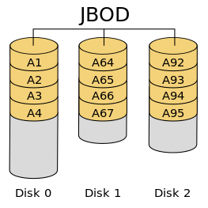
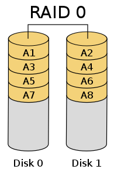
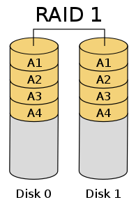
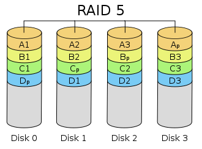
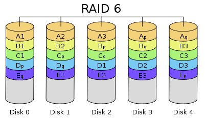
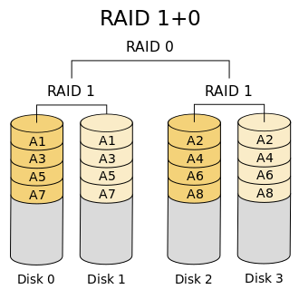
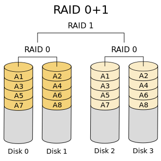
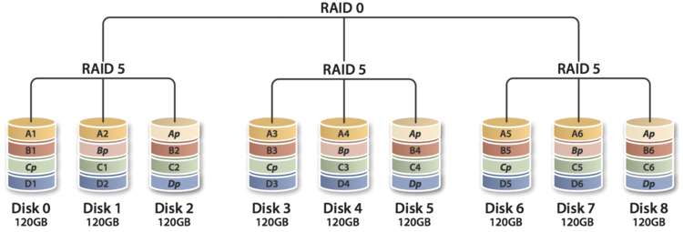
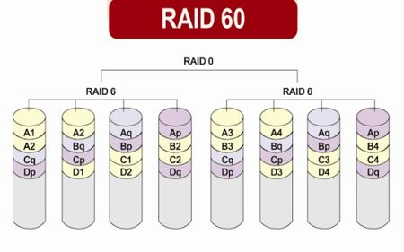

# RAID tour

本文简单介绍一下RAID的几种类型和基于硬件和软件的实现

> RAID: Redundant Array of (Inexpensive -> Independent) Disks 独立硬盘冗余阵列

RAID的逻辑利用虚拟化存储技术把多个硬盘组合起来 成为一个或多个硬盘阵列组 目的为提升性能和/或资料冗余

RAID级别只表示不同的组合方式

主流的可使用RAID

| RAID等级 | 最少硬盘 | 最大容错 | 可用容量 | 读取性能 | 写入性能 | 安全性 | 目的 | 应用产业 |
| :---: | :---: | :---: | :---: | :---: | :---: | :---: | :---: | --- |
| 单一硬盘 | (参考) | 0 | 1 | 1 | 1 | 无 |  |  |
| JBOD | 1 | 0 | n | 1 | 1 | 无（同RAID 0） | 增加容量 | 个人（暂时）存储备份 |
| 0 | 2 | 0 | n | n | n | 一个硬盘异常，全部硬盘都会异常 | 追求最大容量、速度 | 视频剪接缓存用途 |
| 1 | 2 | n-1 | 1 | n | 1 | 高，一个正常即可 | 追求最大安全性 | 个人、企业备份 |
| 5 | 3 | 1 | n-1 | n-1 | n-1 | 中下至中 | 追求最大容量、最小预算 | 个人、小型企业备份 |
| 6 | 4 | 2 | n-2 | n-2 | n-2 | 中至中高 | 仅安全性较RAID 5高" | 同RAID 5，但较安全 | 个人、企业备份 |
| 10 | 4 |  |  |  |  | 高 | 综合RAID 0/1优点，理论速度较快 | 大型数据库、服务器 |
| 50 | 6 |  |  |  |  | 高 | 提升资料安全 |  |
| 60 | 8 |  |  |  |  | 高 | 提升资料安全 |  |

## RAID方案

RAID方案一般分为
- 标准RAID: RAID[0,6]
- 混合RIAD:
  - JBOD
  - RAID10/01
  - RAID50
  - RAID60

### JBOD

Just a Bunch Of Disks 将多个硬盘在操作系统中合并为一个逻辑硬盘 直接增加容量

### RAID0

并联两块以上的磁盘为一个大容量盘

存放数据时分段后分散存放到不同磁盘

读写最快 但没有冗余和容错

### RAID1

两块以上的磁盘互为镜像

读取速度与RAID0相当 写入速度比单块磁盘稍低

$size=\text{min}(S_1,S_2,...,S_n)$

### RAID5

RAID5使用具有分布式奇偶校验的块级条带化 将校验信息均分在不同硬盘上 容量为n-1

> Write Hole: RAID5写入数据分为数据写入和校验记录 在两步之间中断的话 RAID重建会出现错误数据

$size=(n-1)*\text{min}(S_1,S_2,...,S_n)$

### RAID6

RAID6使用两种独立的奇偶校验算法 需要更大磁盘空间和校验计算 一般通过硬件(阵列卡)实现

$size=(n-2)*\text{min}(S_1,S_2,...,S_n)$

### RAID10

混合RAID的实现为先组合成前一种RAID 再组合为后一种RAID

如RAID10=RAID0(RAID1) 即先镜像再扩容

RAID10的可靠性优于RAID01(一般没人用) RAID10一块磁盘损坏不影响其他磁盘

### RAID50

### RAID60

使用门槛比较高

## 基于软件的RAID

- 多设备的抽象层: Linux [madadm](https://en.wikipedia.org/wiki/Mdadm) 使用可以参考[这里](https://zhuanlan.zhihu.com/p/63990027)
- 通用逻辑卷管理: LVM
- 文件系统实现: [ZFS][zfs]/[Btrfs][btrfs]

## references

- <https://wiki.archlinux.org/title/RAID>
- <https://en.wikipedia.org/wiki/RAID>
- <https://zh.wikipedia.org/wiki/RAID>

[zfs]: https://en.wikipedia.org/wiki/ZFS
[btrfs]: https://en.wikipedia.org/wiki/Btrfs